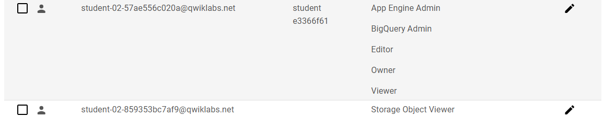

# CodeTech_IT

### Name: Vedant Patil
### Company: Codtech IT Solutions
### ID: CT08HSO
### Domain: Cloud Computing
### Duration: 4 WEEKS
### Mentor: NEELA SANTOSH KUMAR
---
# Tasks:

This project involves leveraging cloud technologies to implement and secure a multi-cloud architecture using Google Cloud Platform (GCP) and Amazon Web Services (AWS). The tasks include setting up cloud storage, configuring monitoring and alerts, deploying a multi-cloud architecture, and implementing cloud security measures. Below is a detailed description of each task.

---

## Task 1: Cloud Storage Setup

The first step in this project involved setting up a robust and scalable storage solution using Google Cloud Storage. A Cloud Storage bucket was created to store static files for a website and other project artifacts. The bucket was configured for public access and static website hosting, enabling seamless distribution of web assets.

**Steps Involved:**
1. Created a new GCP project and enabled the Cloud Storage API.
2. Configured a Cloud Storage bucket with public access permissions.
3. Uploaded static website files to the bucket and configured it for static website hosting using the `gcloud` CLI tool.
4. Verified the setup by accessing the hosted website through the public URL of the bucket.

This task demonstrated the ease of setting up and using GCP's Cloud Storage for hosting static websites and managing data in a secure and scalable manner.

---

## Task 2: Cloud Monitoring and Alerts

The next step involved configuring GCP's Cloud Monitoring to ensure the infrastructure is running optimally and any anomalies are promptly identified. Monitoring dashboards and alerting policies were created to track the health and performance of resources.

**Steps Involved:**
1. Enabled the Cloud Monitoring API.
2. Configured a monitoring dashboard to display key metrics such as CPU usage, memory utilization, and network traffic.
3. Set up alerting policies to notify administrators of potential issues, such as high resource utilization or unexpected downtime.
4. Tested the alerts by simulating scenarios that triggered the conditions.

This task highlighted the importance of proactive monitoring and incident management to ensure high availability and performance of cloud resources.

---

## Task 3: Multi-Cloud Architecture

To leverage the best of both worlds, a multi-cloud architecture was implemented using GCP for the frontend and AWS for the backend. This setup aimed to distribute workloads across different platforms for improved resilience and flexibility.

**Frontend on GCP:**
- A static website was hosted on GCP Cloud Storage, configured for public access.
- The website interacts with the backend through API calls.

**Backend on AWS:**
- A Flask application was developed and deployed on an AWS EC2 instance.
- The EC2 instance was configured with a security group to allow HTTP and HTTPS traffic.
- The backend API was tested for seamless integration with the frontend.

This task demonstrated the capability to integrate services across multiple cloud platforms, ensuring scalability and fault tolerance.

---

## Task 4: Cloud Security Implementation

Security was a critical focus of this project. GCP's Cloud KMS (Key Management Service) was used to encrypt and secure sensitive data. The following measures were taken to implement cloud security:

**Steps Involved:**
1. Created a Cloud Storage bucket for storing encrypted data.
2. Enabled the Cloud KMS API and configured a keyring and cryptokey for encryption.
3. Encrypted sensitive files using the cryptokey and uploaded the encrypted data to the storage bucket.
4. Configured IAM policies to restrict access to the cryptokey and bucket, ensuring only authorized users could perform encryption or decryption operations.
5. Tested the encryption and decryption process to ensure data integrity and security.

This task underscored the importance of securing data at rest and controlling access through robust IAM policies.

---

## Conclusion

This project provided hands-on experience in setting up and managing cloud resources across GCP and AWS, implementing monitoring and alerting mechanisms, deploying a multi-cloud architecture, and securing data with advanced encryption techniques. By combining the strengths of multiple cloud platforms and adhering to best practices in security and monitoring, this project exemplifies a modern approach to building resilient and scalable cloud-based applications.

---

