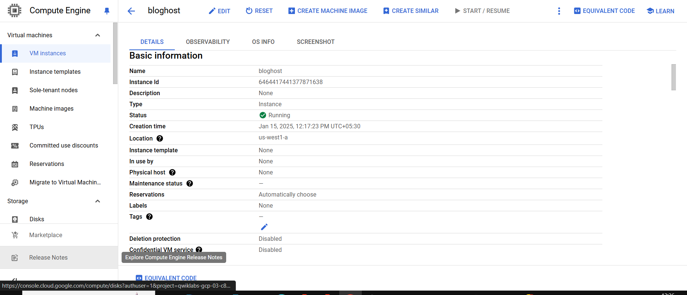

# Task 1
# Cloud Resource Setup: VM Instance and Cloud Storage Bucket

This repository provides a guide and example scripts to set up essential cloud resources:
1. A Virtual Machine (VM) instance.
2. A Cloud Storage bucket.

---

## **Prerequisites**
- A Google Cloud Platform (GCP) account.
- The `gcloud` CLI installed and authenticated.
- Billing enabled for your GCP project.

---

## **1. Setting Up a VM Instance**

### **Description**
A Virtual Machine (VM) instance is used to run applications, host services, or perform computational tasks.

### **Command**
The following command creates a VM instance named `vm-instance-1` in the `us-central1-a` zone using an `e2-medium` machine type:

```bash
gcloud compute instances create vm-instance-1 \
    --zone=us-central1-a \
    --machine-type=e2-medium \
    --image-family=debian-11 \
    --image-project=debian-cloud \
    --boot-disk-size=20GB \
    --boot-disk-type=pd-balanced \
    --tags=http-server,https-server
```


## **2. Setting Up a Cloud Storage Bucket**

### **Description**
A Cloud Storage bucket is used to store and manage objects like application data, backups, and logs. Below are the steps to create and configure a bucket.

### **Command**
The following command creates a Cloud Storage bucket named `my-storage-bucket` in the `us-central1` region:

```bash
gcloud storage buckets create my-storage-bucket \
    --location=us-central1 \
    --storage-class=STANDARD
gcloud config set project [PROJECT_ID]
```


