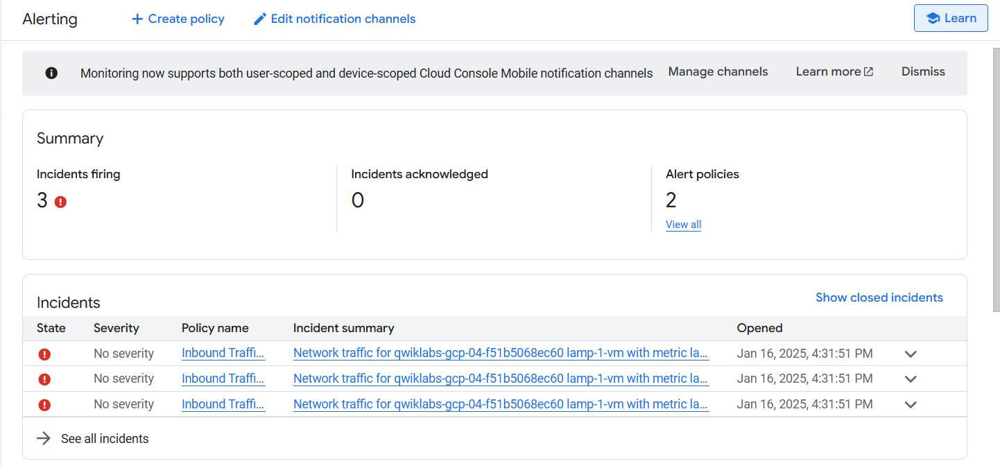
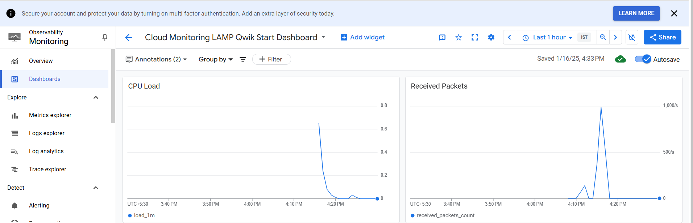

# Task 2
# Google Cloud Monitoring and Alerts Setup

This repository demonstrates how to set up Google Cloud Monitoring for a cloud-based application. Follow the steps below to configure monitoring, alerts, and a dashboard to track critical metrics.

---

## Setup Instructions

### Step 1: Install Apache2 and PHP

```bash
# Update package lists
sudo apt-get update

# Install Apache2 and PHP 7.0
sudo apt-get install apache2 php7.0

# Restart the Apache2 service
sudo service apache2 restart
```
### Step 2: Install the Monitoring and Logging Agents
```bash
# Download and install the Google Cloud Operations Agent
curl -sSO https://dl.google.com/cloudagents/add-google-cloud-ops-agent-repo.sh
sudo bash add-google-cloud-ops-agent-repo.sh --also-install

# Check the status of the Google Cloud Operations Agent
sudo systemctl status google-cloud-ops-agent"*"

# Update package lists again
sudo apt-get update
```
### Step 3: Create an Uptime Check
```bash
1. Navigate to Google Cloud Console > Monitoring > Uptime Checks.
2. Configure the following settings:
   - Protocol: HTTP
   - Resource Type: Instance
   - Instance: lamp-1-vm
   - Check Frequency: 1 minute
   - Title: Lamp Uptime Check
3. Save the uptime check.
```
### Step 4: Create an Alerting Policy
```bash
1. Navigate to Google Cloud Console > Monitoring > Alerting.
2. Create a new alerting policy with the following settings:
   - Alert Name: Inbound Traffic Alert
   - Condition: Define based on your traffic threshold.
   - Notification Channel: Add an email or SMS notification.
3. Save the alerting policy.
```

### Step 5: Create a Dashboard and Charts
```bash
1. Navigate to Google Cloud Console > Monitoring > Dashboards.
2. Create a new dashboard.
3. Add the following charts:
   - 1st Chart (Line): Load
   - 2nd Chart (Line): Received Packets
4. Save the dashboard.
```

