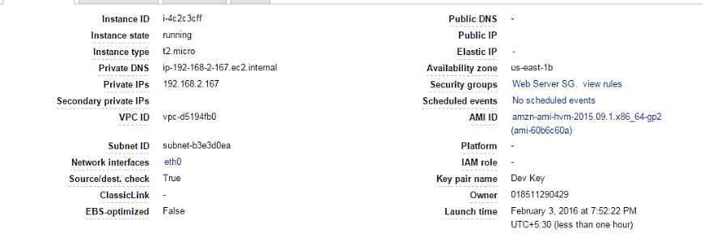

# Task 3
# Multi-Cloud Deployment: Frontend on Google Cloud, Backend on AWS

This project demonstrates deploying a static website frontend on Google Cloud Platform (GCP) and a Flask backend API on Amazon Web Services (AWS). The goal is to understand the process of setting up, deploying, and integrating services across multiple cloud platforms.

---

## Project Overview

- **Frontend**: Hosted on Google Cloud Storage (static website hosting).
- **Backend**: Hosted on AWS EC2.
- **Communication**: The frontend interacts with the backend via RESTful API endpoints.
- **Tech Stack**:
  - Frontend: HTML, CSS, JavaScript.
  - Backend: Python Flask.

---

## Prerequisites

1. **Accounts**: Active GCP and AWS accounts.
2. **Tools**:
   - Python 3 (for backend setup).
   - Cloud CLI tools: `gcloud` and `aws-cli`.
3. **IAM Roles**: Ensure appropriate roles are assigned for managing resources on GCP and AWS.

---

## Steps to Build and Deploy the Project

### 1. Setup Frontend on GCP

#### a. Create a GCP Project
1. Log in to [Google Cloud Console](https://console.cloud.google.com/).
2. Create a new project and name it `multi-cloud-frontend`.
3. Enable the Cloud Storage API.

#### b. Develop the Frontend
1. Create a static website with the following file structure:
   ```
   /frontend
   |-- index.html
   |-- style.css
   |-- app.js
   ```
2. Example `index.html`:
   ```html
   <!DOCTYPE html>
   <html lang="en">
   <head>
       <meta charset="UTF-8">
       <meta name="viewport" content="width=device-width, initial-scale=1.0">
       <title>Frontend on GCP</title>
       <link rel="stylesheet" href="style.css">
   </head>
   <body>
       <h1>Hello from GCP Frontend</h1>
       <script src="app.js"></script>
   </body>
   </html>
   ```

#### c. Deploy Frontend
1. Create a Cloud Storage bucket:
   ```bash
   gcloud storage buckets create BUCKET_NAME --location=REGION
   ```
2. Upload the frontend files:
   ```bash
   gcloud storage cp /path/to/frontend/* gs://BUCKET_NAME/
   ```
3. Make the bucket publicly accessible and configure it for website hosting:
   ```bash
   gcloud storage buckets set-public-access BUCKET_NAME
   gcloud storage websites set gs://BUCKET_NAME --main-page-suffix index.html
   ```


---

### 2. Setup Backend on AWS

#### a. Launch AWS EC2 Instance
1. Log in to [AWS Management Console](https://aws.amazon.com/console/).
2. Navigate to EC2 and launch an instance:
   - AMI: Ubuntu 22.04
   - Instance Type: t2.micro (free tier eligible)
3. Configure security group to allow HTTP and HTTPS traffic.

#### b. Develop the Backend
1. SSH into the EC2 instance:
   ```bash
   ssh -i your-key.pem ubuntu@EC2_PUBLIC_IP
   ```
2. Install necessary packages:
   ```bash
   sudo apt update
   sudo apt install python3-pip
   pip install flask
   ```
3. Create a Flask app:
   ```python
   from flask import Flask, jsonify

   app = Flask(__name__)

   @app.route('/api', methods=['GET'])
   def api():
       return jsonify({"message": "Hello from AWS Backend!"})

   if __name__ == '__main__':
       app.run(host='0.0.0.0', port=5000)
   ```
4. Test locally using `python app.py`.

#### c. Deploy and Test API
1. Start the Flask app on the EC2 instance.
2. Access the API using the EC2 public IP:
   ```bash
   curl http://EC2_PUBLIC_IP:5000/api
   ```



---

### 3. Connect Frontend and Backend

1. Update the frontend JavaScript to call the backend API:
   ```javascript
   fetch('http://EC2_PUBLIC_IP:5000/api')
       .then(response => response.json())
       .then(data => console.log(data));
   ```
2. Deploy the updated frontend to GCP.

---

### 4. Testing and Validation

1. Access the frontend URL.
2. Confirm that the backend API response is displayed on the frontend.
3. Validate end-to-end functionality.

**Suggested Screenshot**:
- Final integrated frontend displaying data from the backend.

---

## Conclusion
This project demonstrates the basics of multi-cloud deployment, combining GCP for the frontend and AWS for the backend. It showcases the flexibility of using multiple cloud platforms to build scalable and resilient applications.

---

