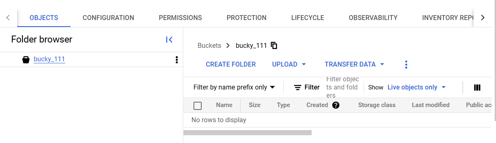
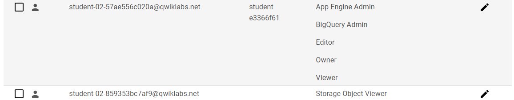

# Task 4
# Cloud Storage Data Encryption and IAM Configuration

This guide explains how to create a Google Cloud Storage bucket, enable Cloud Key Management Service (KMS), create keyrings and cryptographic keys, encrypt and decrypt data, and configure IAM permissions.

---

### Step 1: Create a Cloud Storage Bucket

Create a new Cloud Storage bucket:
```bash
BUCKET_NAME="bucky_111"
gsutil mb gs://${BUCKET_NAME}
```


### Step 2: Enable Cloud KMS

Activate the Cloud Key Management Service (KMS):
```bash
gcloud services enable cloudkms.googleapis.com
```

### Step 3: Create a Keyring and Cryptokey

Define keyring and cryptokey names, then create them:
```bash
KEYRING_NAME=test
CRYPTOKEY_NAME=qwiklab

gcloud kms keyrings create $KEYRING_NAME --location global

gcloud kms keys create $CRYPTOKEY_NAME --location global \
      --keyring $KEYRING_NAME \
      --purpose encryption
```

### Step 4: Encrypt and Decrypt Your Data

Encrypt data and upload it to the Cloud Storage bucket:
```bash
# Base64 encode your plaintext file
PLAINTEXT=$(cat 1. | base64 -w0)

# Encrypt the data using the cryptographic key
curl -v "https://cloudkms.googleapis.com/v1/projects/$DEVSHELL_PROJECT_ID/locations/global/keyRings/$KEYRING_NAME/cryptoKeys/$CRYPTOKEY_NAME:encrypt" \
  -d "{\"plaintext\":\"$PLAINTEXT\"}" \
  -H "Authorization:Bearer $(gcloud auth application-default print-access-token)" \
  -H "Content-Type: application/json"

# Save the ciphertext to a file
curl -v "https://cloudkms.googleapis.com/v1/projects/$DEVSHELL_PROJECT_ID/locations/global/keyRings/$KEYRING_NAME/cryptoKeys/$CRYPTOKEY_NAME:encrypt" \
  -d "{\"plaintext\":\"$PLAINTEXT\"}" \
  -H "Authorization:Bearer $(gcloud auth application-default print-access-token)" \
  -H "Content-Type:application/json" \
| jq .ciphertext -r > 1.encrypted

# Decrypt the data
curl -v "https://cloudkms.googleapis.com/v1/projects/$DEVSHELL_PROJECT_ID/locations/global/keyRings/$KEYRING_NAME/cryptoKeys/$CRYPTOKEY_NAME:decrypt" \
  -d "{\"ciphertext\":\"$(cat 1.encrypted)\"}" \
  -H "Authorization:Bearer $(gcloud auth application-default print-access-token)" \
  -H "Content-Type:application/json" \
| jq .plaintext -r | base64 -d

# Upload the encrypted file to Cloud Storage
gsutil cp 1.encrypted gs://${BUCKET_NAME}
```

### Step 5: Configure IAM Permissions

Grant IAM roles for managing and encrypting/decrypting data:
```bash
# Get the current user's email
USER_EMAIL=$(gcloud auth list --limit=1 2>/dev/null | grep '@' | awk '{print $2}')

# Assign Cloud KMS admin role
gcloud kms keyrings add-iam-policy-binding $KEYRING_NAME \
    --location global \
    --member user:$USER_EMAIL \
    --role roles/cloudkms.admin

# Assign Cloud KMS encrypter/decrypter role
gcloud kms keyrings add-iam-policy-binding $KEYRING_NAME \
    --location global \
    --member user:$USER_EMAIL \
    --role roles/cloudkms.cryptoKeyEncrypterDecrypter
```



---

## Explanation of Steps

1. **Cloud Storage Bucket Creation**:
   - `gsutil mb`: Creates a new storage bucket for storing encrypted data.

2. **Enable Cloud KMS**:
   - Activates the Cloud KMS API required for managing encryption keys.

3. **Keyring and Cryptokey Creation**:
   - `gcloud kms keyrings create`: Creates a logical container for cryptographic keys.
   - `gcloud kms keys create`: Generates a key for encryption purposes.

4. **Encrypt and Decrypt Data**:
   - `curl`: Interacts with the Cloud KMS API to encrypt and decrypt data.
   - `jq`: Parses JSON responses to extract ciphertext or plaintext.
   - `gsutil cp`: Uploads encrypted data to the storage bucket.

5. **Configure IAM Permissions**:
   - Grants required roles for managing and using encryption keys securely.

---


